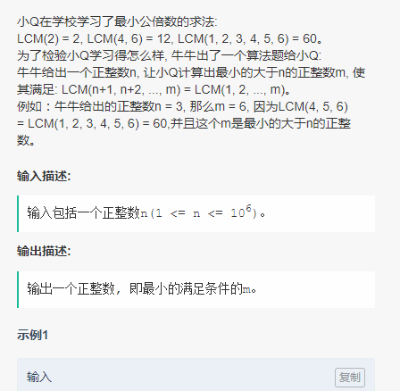

### 2018年9月腾讯校招笔试题解

#### 第一题


> 第一题思路是区间LCM，网上均有各种各样的题解，可以搜搜看看不同做法
```cpp
#include <iostream>
#include <algorithm>
#include <cstring>
using namespace std;
const int BORDER = 1e6+6;
bool visit[BORDER];
int prime[BORDER];
int len = 0;
//count if is prime,and record the prime in prime array
void countPrime(){
    for(int i=2;i<BORDER;i++){
        if(!visit[i]){
            prime[len++]=i;
            for(int j=i+i;j<BORDER;j+=i){
                visit[j]=true;
            }
        }
    }
}
int main(){
    int n;
    countPrime();
    while(cin>>n){
        long long maxPrime = 1;
        for(int i = 0; prime[i] <= n; i++){
            long long k = prime[i];
            //prime^k
            while( k*prime[i] <= n){
               k *= prime[i];
            }
            maxPrime = max(maxPrime,k);
        }
        cout<<2*maxPrime<<endl;
    }
    return 0;
}
```


#### 第二题


> 思路就是每次输入一条新的边时，同时获取以起点为终点的城市集合v1，和以终点为起点的城市集合v2，然后任意v1到任意v2设置为true即可，最后统计一下入度出度，满足条件计数器+1，返回结果即可

```cpp
//100%
#include <map>
#include <vector>
#include <iostream>
using namespace std;
int main(){
    int n,m;
    while(cin>>n>>m){
        vector<vector<bool>> city(n+1,vector<bool>(n+1,false));
        for(int i=0;i<m;i++){
            int from,to;
            cin>>from>>to;
            city[from][to] = true;
            vector<int> start,end;
            for(int j=1;j<=n;j++){
                if(city[to][j]){
                    end.push_back(j);
                    city[from][j] = true;
                }
                if(city[j][from]){
                    start.push_back(j);
                    city[j][to] = true;
                }
            }
            for(auto st:start){
                for(auto ed:end){
                    city[st][ed] = true;
                }
            }
        }
        int res = 0;
        for(int i=1;i<=n;i++){
            int in = 0,out = 0;
            for(int j =1;j<=n;j++){
                if(city[i][j]){
                    out++;
                }
                if(city[j][i]){
                    in++;
                }
            }
            if(in>out){
                res++;
            }
        }
        cout<<res<<endl;
    }
    return 0;
}
```

#### 第二题


> 思路就是暴力，枚举A的倍数到B-1，然后每个都按照公式判断一次即可，没找对应的数学解释，因为B<100所以一般不会超时

```cpp
#include <iostream>
using namespace std;
int main(){
    int n;
    while(cin>>n){
        for(int i=0;i<n;i++){
            int a,b,c;
            cin>>a>>b>>c;
            if(c==0){
                cout<<"YES"<<endl;
                continue;
            }
            bool flag = false;
            for(int i=1;i<=b*c;i++){
                if((a*i)%b==c){
                    cout<<"YES"<<endl;
                    flag = true;
                    break;
                }
            }
            if(!flag){
                cout<<"NO"<<endl;
            }
        }
    }
    return 0;
}
```